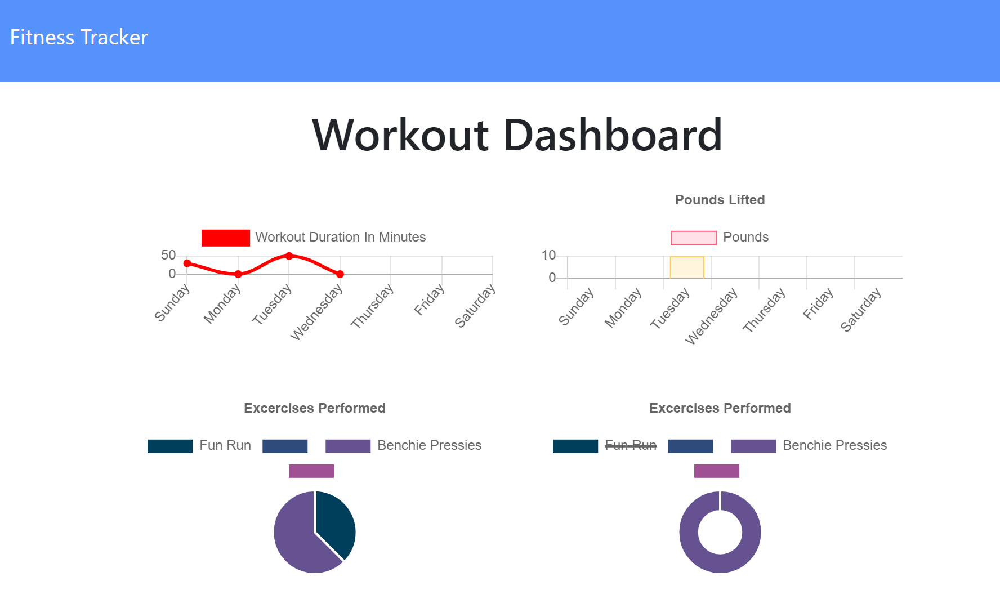

# workout-tracker
To help keep track of your workouts

## Table of Contents
* [Description](#description)
* [Installation](#installation)
* [Usage](#usage)
* [Links](#links)
* [License](#license) 
* [Contributions](#contributions)
* [Questions](#questions)  

## Description
This application will keep track of the user's workouts, with the user able to create multiple exercises within a single workout. The application also displays a statistic page based on the last seven workouts the user inputed.

## Installation

This code can be forked and cloned onto one's local device through GitHub. Please make sure you are using the correction applications for administering this code onto your device, such as Terminal and Visual Studio Code. The user must also have a basic understanding of using MongoDB and Mongoose.js.

## Usage

The primary usage of this code is to keep track of a user's workouts.

## Links
[GitHub repository](https://github.com/cheacliatt/workout-tracker "Repository")

[Heroku Server](https://intense-springs-07143.herokuapp.com/ "Heroku")

## License

MIT License

Copyright (c) [2020] [Chea Cliatt]

Permission is hereby granted, free of charge, to any person obtaining a copy
of this software and associated documentation files (the "Software"), to deal
in the Software without restriction, including without limitation the rights
to use, copy, modify, merge, publish, distribute, sublicense, and/or sell
copies of the Software, and to permit persons to whom the Software is
furnished to do so, subject to the following conditions:

The above copyright notice and this permission notice shall be included in all
copies or substantial portions of the Software.

THE SOFTWARE IS PROVIDED "AS IS", WITHOUT WARRANTY OF ANY KIND, EXPRESS OR
IMPLIED, INCLUDING BUT NOT LIMITED TO THE WARRANTIES OF MERCHANTABILITY,
FITNESS FOR A PARTICULAR PURPOSE AND NONINFRINGEMENT. IN NO EVENT SHALL THE
AUTHORS OR COPYRIGHT HOLDERS BE LIABLE FOR ANY CLAIM, DAMAGES OR OTHER
LIABILITY, WHETHER IN AN ACTION OF CONTRACT, TORT OR OTHERWISE, ARISING FROM,
OUT OF OR IN CONNECTION WITH THE SOFTWARE OR THE USE OR OTHER DEALINGS IN THE
SOFTWARE.

## Contributions
If you wish to contribute to this project, feel welcomed to contact me.

## Questions
If you have any comments, concerns, or questions about this command line application, feel welcomed to send an email at: cheacliatt@gmail.com